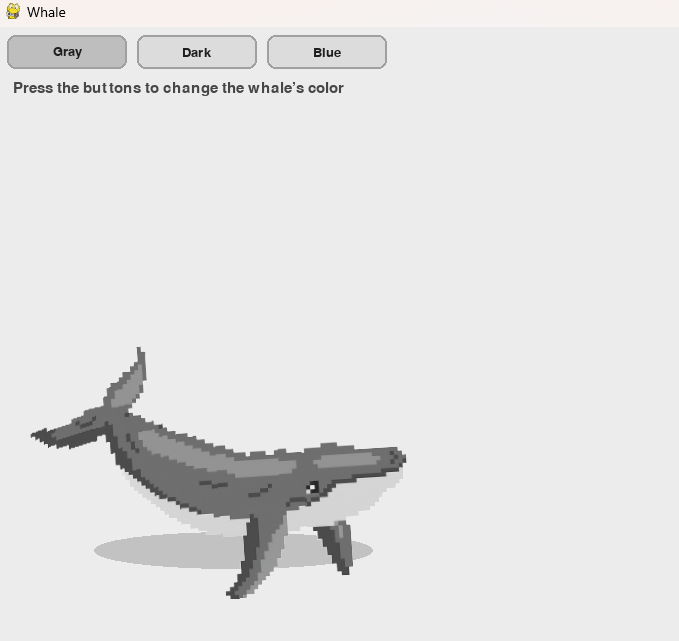
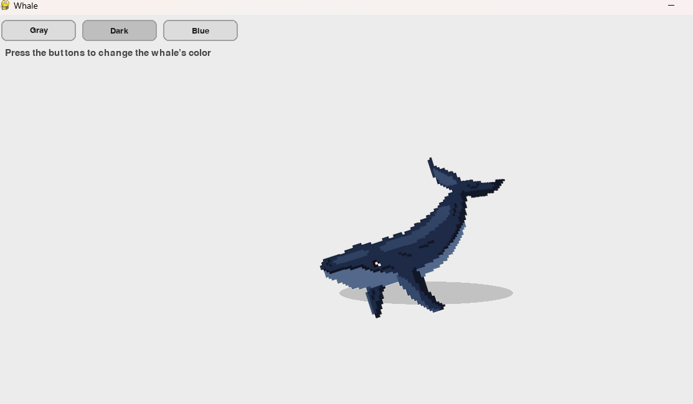
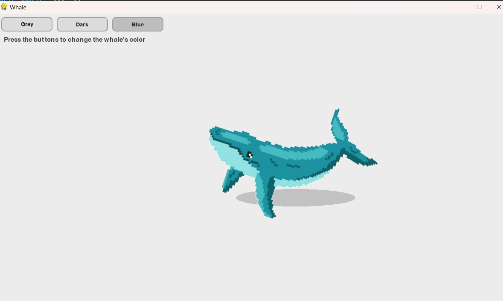

# WhaleProject 

This project demonstrates a simple animation created with **Python** and **pygame**.  
The whale is displayed in different versions – blue, dark blue, gray – to show how images and animations can be combined in a small interactive program.

## How to run
1. Install the required library:
   ```bash
   pip install pygame
   
Run the project:
python whale_swim.py

## Example screenshots

<table>
  <tr>
    <td rowspan="2">
      
    </td>
    <td>
      
    </td>
  </tr>
  <tr>
    <td>
      
    </td>
  </tr>
</table>


